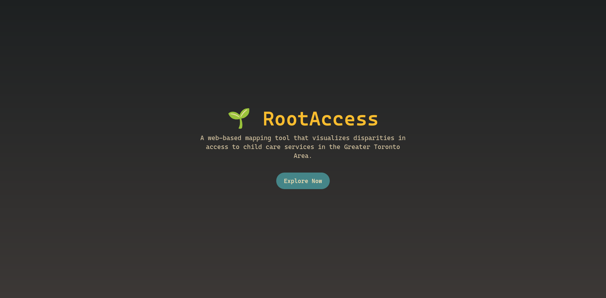
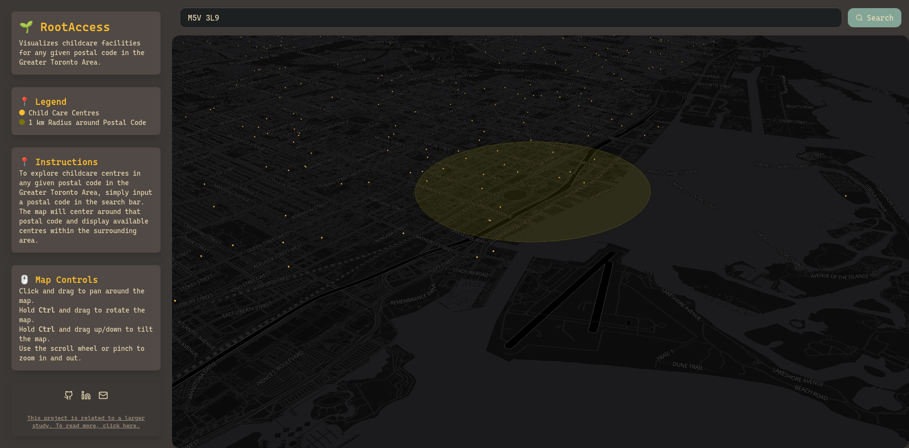

# 🌱 RootAccess

RootAccess is a **web-based mapping tool** that visualizes **spatial disparities in access to child care services** across the Greater Toronto Area (GTA), with a particular focus on immigrant families.  
This interactive app is designed to support **equity-driven urban planning** by highlighting geographic inequalities in child care accessibility.

> 🔧 **Work in Progress** — This is an early-stage prototype. Features, data, and design will continue to evolve.

---

## ✨ Features

✅ Smooth animated landing-to-map transition  
✅ Postal code search with smart zoom + highlighting  
✅ Accurate GeoJSON rendering of licensed child care locations  
✅ Clean, responsive UI with modern styling  
✅ Focused on **spatial justice** and **equitable access**

---

## 🧭 App Preview

| Landing Page | Postal Code Search |
|--------------|--------------------|
|  |  |

---

## 🛠️ Technologies Used

| Tech / Library        | Purpose                               |
|-----------------------|----------------------------------------|
| **React**             | App structure and UI                   |
| **TypeScript**        | Type safety and scalability            |
| **Tailwind CSS**      | Fast, utility-first styling            |
| **React-Map-GL / MapLibre** | Map rendering and geospatial interaction |
| **Framer Motion**     | Smooth animations and transitions      |
| **Turf.js**           | Geospatial analysis (search radius)    |
| **OpenStreetMap / Nominatim** | Postal code geocoding and search   |

---

## 📊 Data Sources

- 🏫 Licensed Child Care Centres — *City of Toronto & GTA municipalities*  
- 🗺️ Census Subdivision Boundaries — *Government of Canada*

---

## 🎯 Purpose

RootAccess was built as part of a research initiative exploring how **transit, housing, and urban planning** shape access to essential services. The app is intended to bring **visibility** to **underserved communities** and **support more inclusive child care planning**.

---

## 💡 Next Steps

- Add filtering by age group, facility type, or walkability index  
- Improve mobile support and loading states  
- Integrate more real-time or policy datasets  
- Add multi-lingual support for immigrant communities

---

## 📬 Contact

Have feedback, suggestions, or want to collaborate?  
Reach out or fork the project — your contributions are welcome!  
🌐 *Project developed by [Your Name], 2025*

